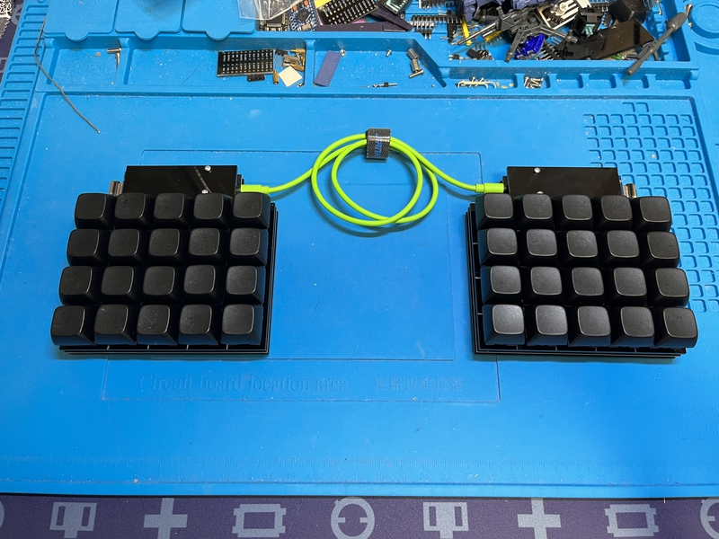

# jisaku20

jisaku20 is a 4x5 macro pad keyboard.
 
jisaku20は４×５のマクロパッドキーボードです。
  
By connecting jisaku20 and jisaku20_right with a TRRS cable, it becomes a 40-key split keyboard.Call it jisaku20x2.
 
jisaku20とjisaku20_rightをTRRSケーブルで繋ぐことにより、40キーの分割キーボードになります。それをjisaku20x2と呼びます。

 
 

## firmware

https://github.com/telzo2000/jisaku20/tree/main/firmware

## Case(acrylic plate)

https://github.com/telzo2000/jisaku20/tree/main/case_design

## Parts list

