# Build guide

## Firmware

###  QMK_FIRMWARE
[Here](https://github.com/telzo2000/jisaku20/tree/main/firmware)

 

参考 

https://github.com/telzo2000/Hello_keyboard/blob/main/readme_about_firmware.md

 

## Build 

### 1 Parts check

jisaku20 and jisaku20_right have a front side and a back side.
 
jisaku20及びjisaku20_rightには表面と裏面があります。
 

Front side

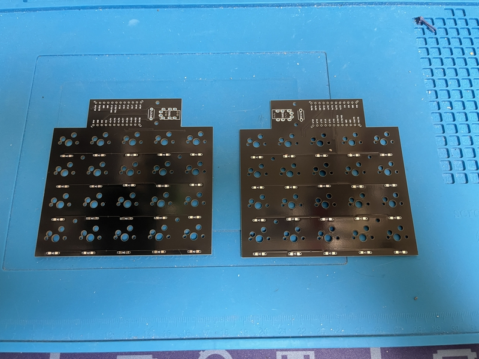

Back side

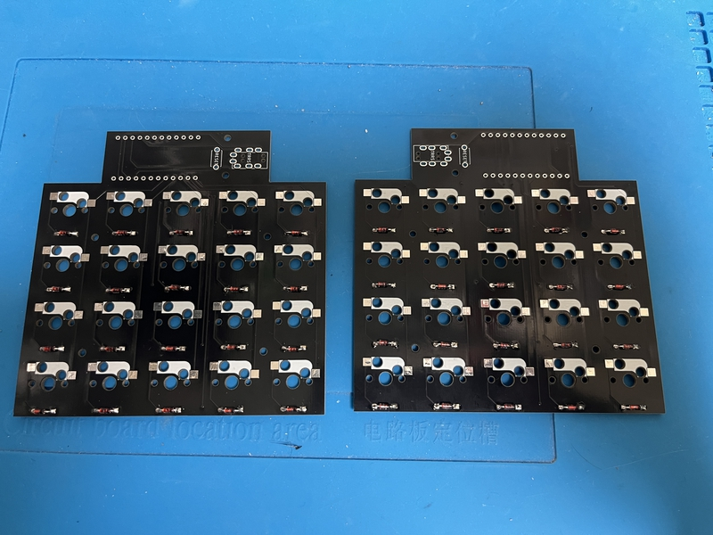

 

### 2 Diode soldering

Note! "The diode's silk is wrong and sticks to the surface."
 
注意！　ダイオードのシルクが間違って、表面に付いています。
  

Solder the diodes to the back of each of the left and right.
 
左右それぞれの裏面にダイオードのハンダ付けをします。
 

There are lead type and SMD diodes.
 
ダイオードはリードタイプか、SMDがあります。
 
Here, we will explain the lead type soldering.
 
ここでは、リードタイプのハンダ付けの説明をします。
 

Use a lead bender to bend the legs of the diode.
 
リードベンダーを使い、ダイオードの足を曲げます。
 
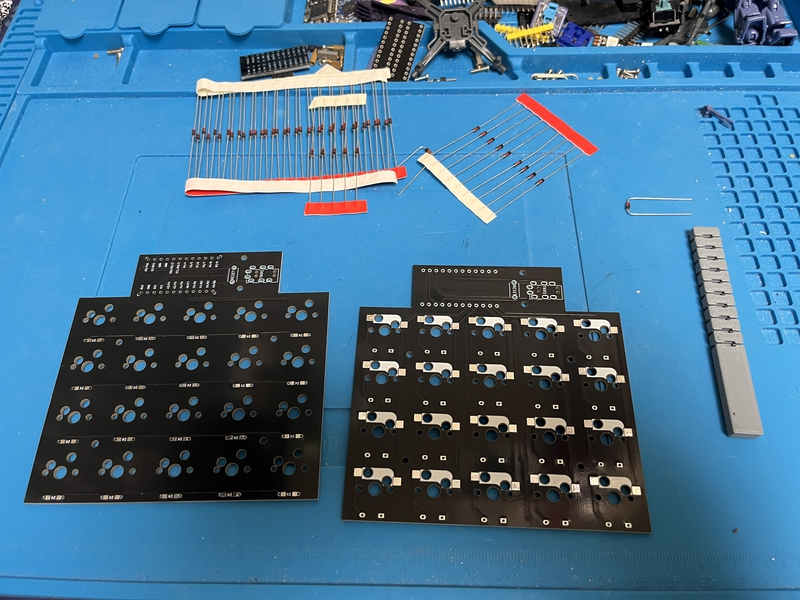

Insert the diode into the board.
 
ダイオードを基板に挿しこみます。
 

Please pay attention to the orientation of the diode.
 
ダイオードの向きに注意してください。
 
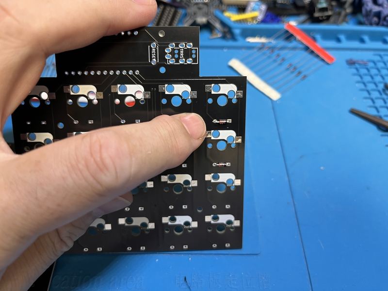

Secure the diode with masking tape, then face up.
 
マスキングテープでダイオードを固定してから、表面を上にします。
 

Solder the protruding legs.
 
はみ出ている足部分に、ハンダ付けをします。
 
After soldering, use nippers to cut off the protruding legs.
 
はんだ付けが終わったら、はみ出ている足をニッパーで切り取ってください。
 

[８倍速　Diodeハンダ付け動画](https://youtu.be/Yaodh2-XxV4)

 
 

### 3 Soldering switch sockets

Solder the switch sockets on the back side.
 
裏面にスイッチソケットのハンダ付けをします。
 
Hold a little solder on the terminals.
 
端子に少しハンダを持ってください。
 

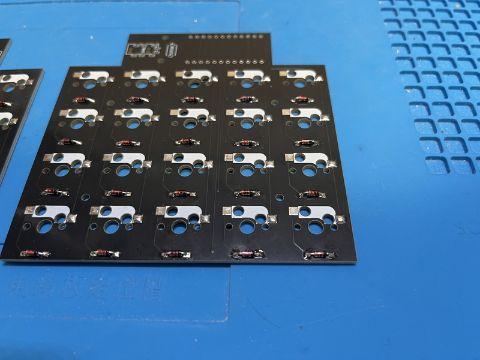

Place the switch so that the silk of the switch socket is hidden. Then, warm the solder that you just poured with a soldering iron.
 
スイッチソケットのシルクが隠れるようにスイッチを載せてください。そして、先ほど盛ったハンダをハンダゴテで温めてください。
 

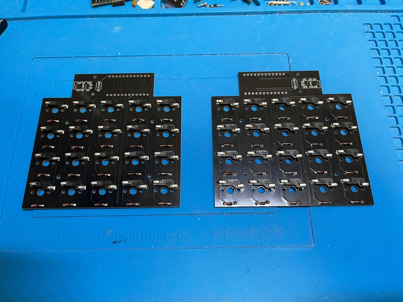

Place the switch socket and fix it with a warm soldering iron while melting the solder.
 
スイッチソケットを乗せて、温めたハンダゴテで、ハンダを溶かしながら、固定します。
 
You can make it easier by working while holding it with tweezers.
 
ピンセットで押さえながら、作業をすると楽にできます。
 

[８倍速　Switch socketハンダ付け動画](https://youtu.be/E__mHvmIXQo)

  

### 4 Soldering reset switch & TRRS jack 

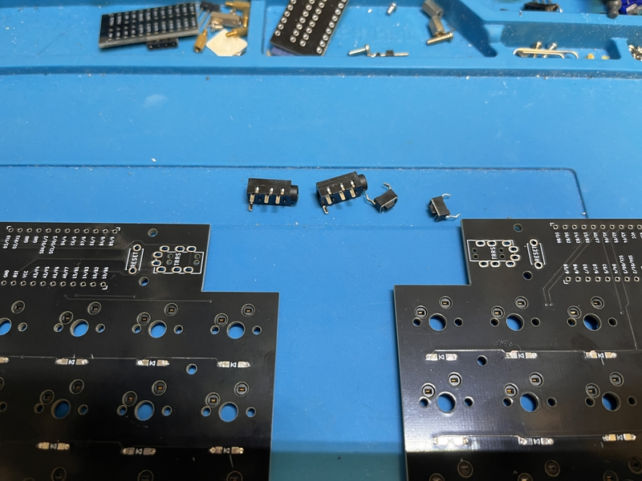

Insert the reset switch on the surface.
 
表面にリセットスイッチを挿しこみます。
 
Solder the legs of the reset switch from the back.
 
裏面からリセットスイッチの足をハンダ付けします。
 
Solder the TRRS jack in the same way near the reset switch.
 
TRRSジャックは、リセットスイッチの近くに同じようにハンダ付けします。
 
Insert the left and right TRRS jacks from the front side and solder from the back side.
 
TRRSジャックは左右１箇所ずつ、表面から差し込み、裏面からはんだ付けをしてください。
 
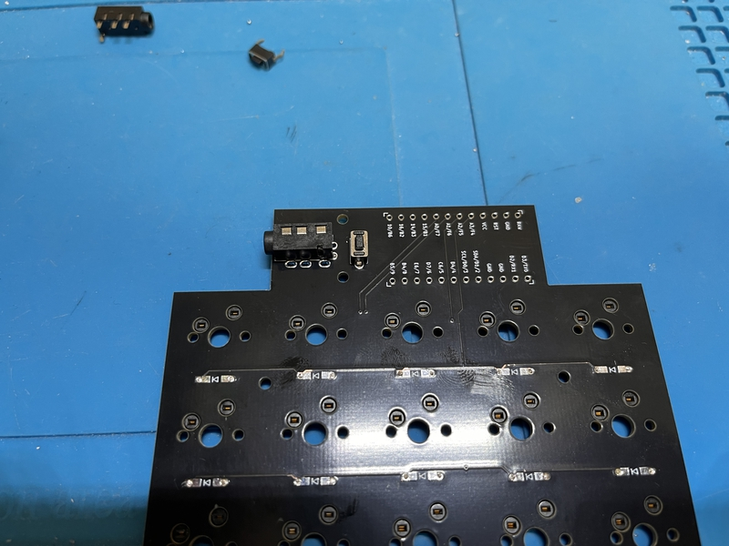

[８倍速　Reset switch,TRRS jackハンダ付け動画](https://youtu.be/3gEbExaOAv4)

  

### 5　Pro micro 

Use the conthrough to fix the pro micro with the side with the parts facing down.
 
pro microの部品のある面を下向きに、コンスルーを使い、固定してください。
 

Pay attention to the orientation of the conthrough.
 
コンスルーの向きに注意してください。
 

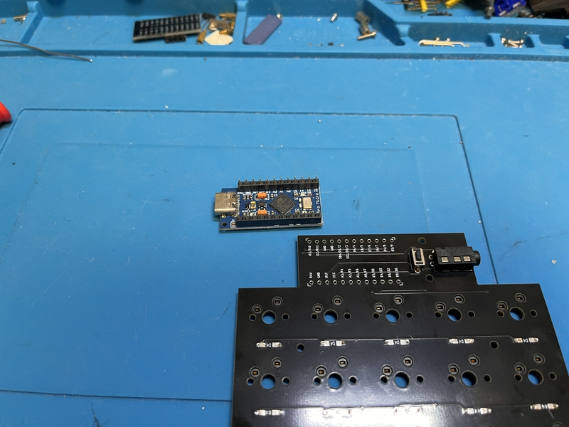

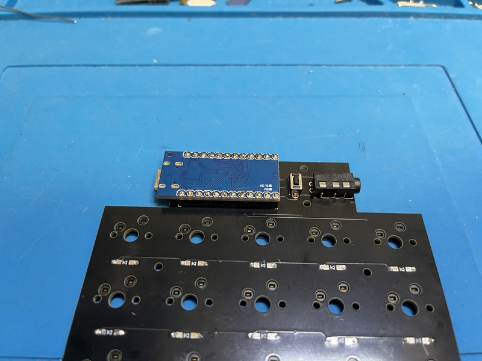

 

### 6　Test

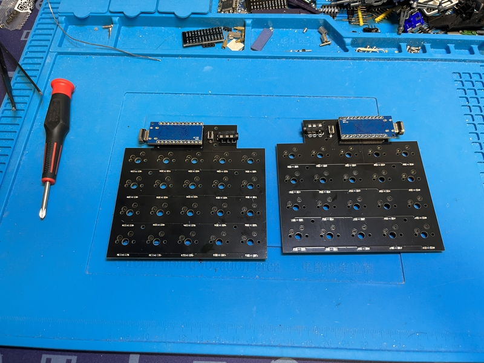

Please write the firmware and check the operation.
 
ファームウェアを書き込んで、動作確認をしてください。
 

Install a switch or measure continuity with tweezers, etc.
 
スイッチを取り付けるか、ピンセット等で導通をはかるかを行います。
 

 

### QMK_FIRMWARE
[Here](https://github.com/telzo2000/jisaku20/tree/main/firmware)

 

### 7 Installation of switch plate（cherry MX switch）

Prepare a switch plate, M2 spacer 3 mm（x８）, and M2 screw 8 mm（x４）.
 
スイッチプレート、M2スペーサー３mm（８本）、M2ネジ８mm（４本）を用意します。
 
Fix the screws in 4 places.
 
ネジを４箇所、固定します。
 
Insert the switch plate into the screw and fix it with a spacer.
 
ネジはスイッチプレートをさしこみ、スペーサーで固定します。
 

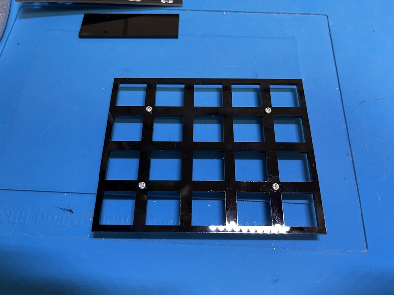

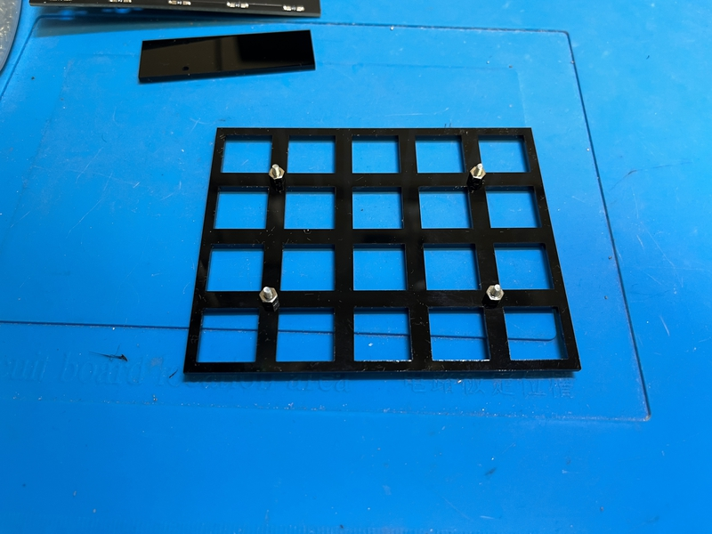

Next, insert the switch plate into the PCB and secure it with a spacer on the back of the PCB.
 
次に、スイッチプレートをPCBにさしこみ、PCBの裏面でスペーサーで固定します。
 
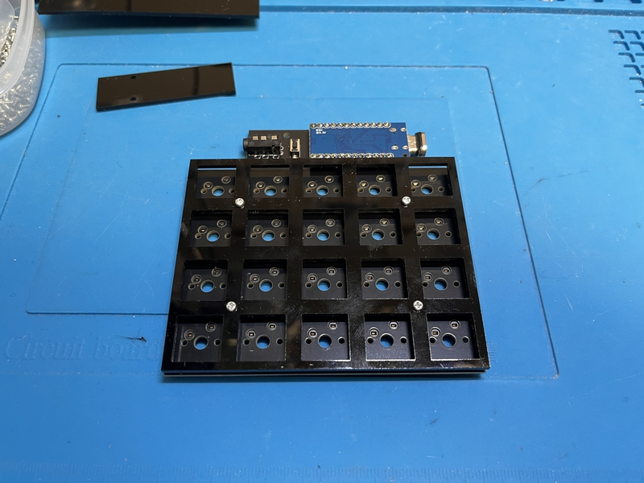

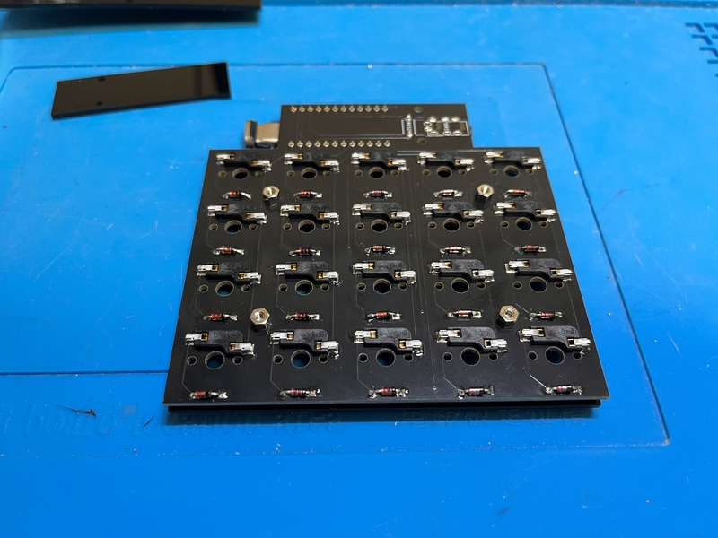

### 8 Installation of cover plate

Prepare a cover plate, M2 spacer 8mm（x2）, and M2 screw 3mm（x4）.
 
カバープレート、M2スペーサー8mm（2個）、M2ネジ3mm（4本）を用意します。
 
Screw the spacer to the cover plate in the same orientation.
 
カバープレートに同じ向きで、スペーサーをネジで固定します。
 
Then use the remaining screws to attach the cover plate to the PCB.
 
次に、残りのネジを使い、カバープレートをPCBに取り付けます。
 
There is an orientation of the cover plate, so it is good to check it once before starting work.
 
カバープレートの向きがあり、作業前に一度、重ねて確認すると良いです。
 
 

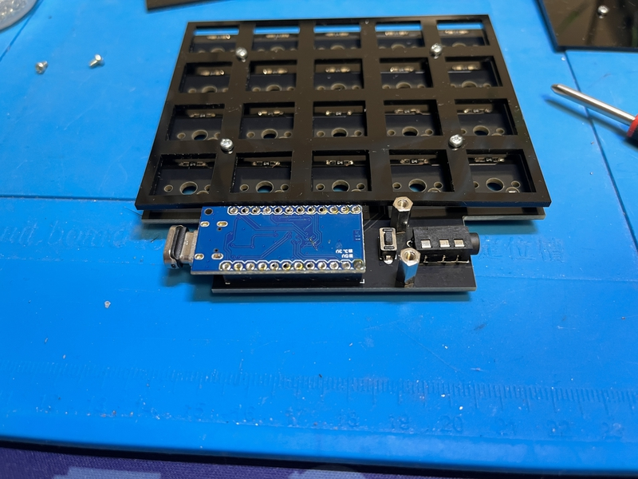

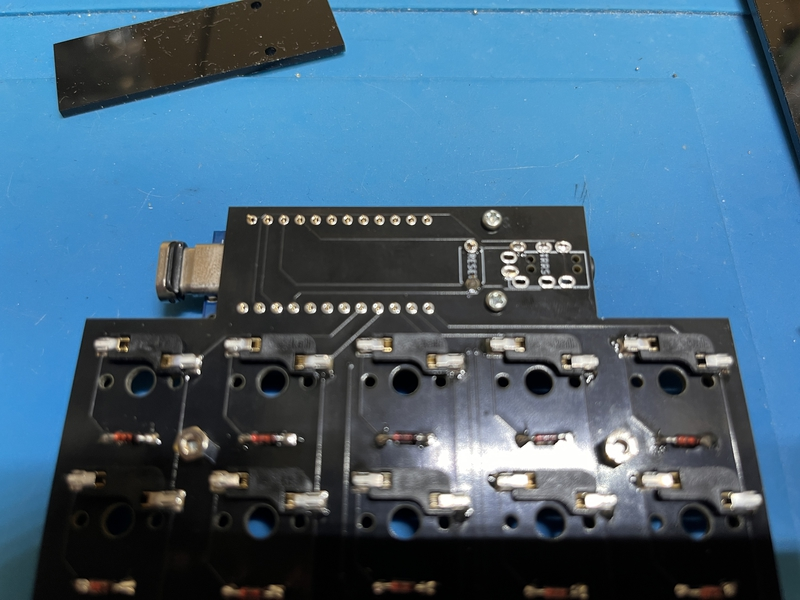

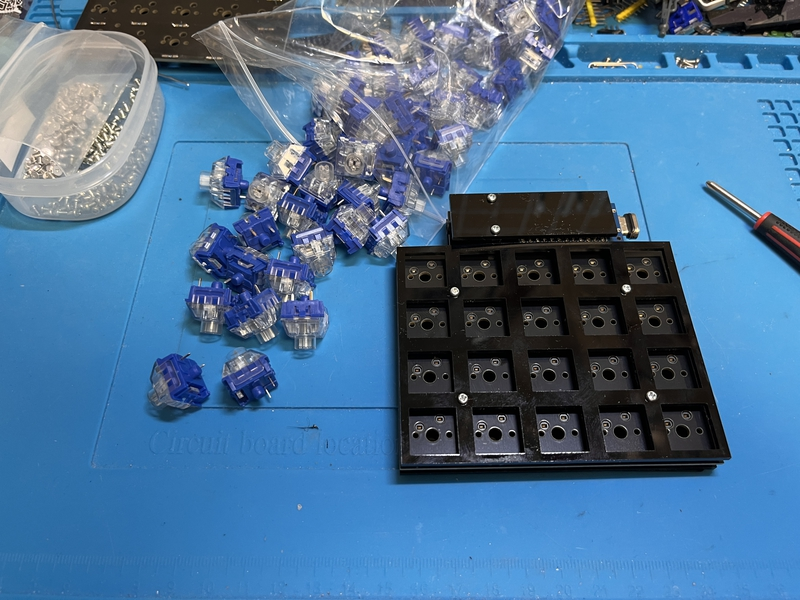

### 9 Installation of bottom plate 

Prepare the bottom plate and M2 ３mm screws（x４）.
 
ボトムプレート、M２ネジ３mm（４本）を用意します。
 
Place the bottom plate according to the spacer on the back of the PCB and fix it with screws.
 
PCB裏面にあるスペーサーに合わせて、ボトムプレートをのせて、ネジで固定します。
 
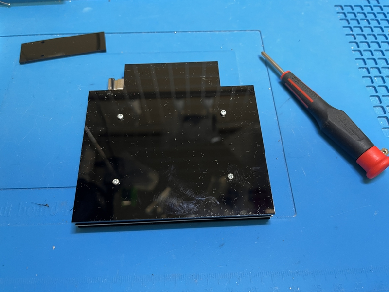

### 10 Installation of switch sockets and keycaps　

Insert your favorite switch socket. Be careful not to bend the lead when inserting it.
 
お気に入りのスイッチソケットを挿入してください。差し込む際リードが曲がらないように注意してください。
 
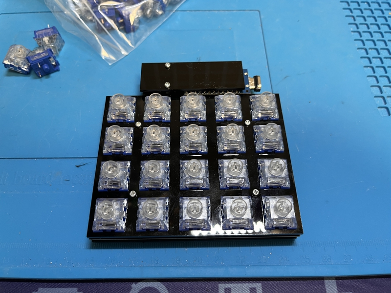

Then insert your favorite keycaps.
 
次に、お気に入りのキーキャップを挿入してください。
 
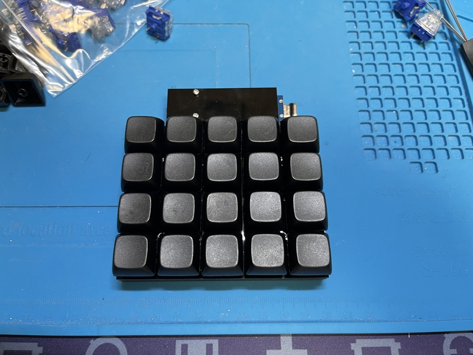

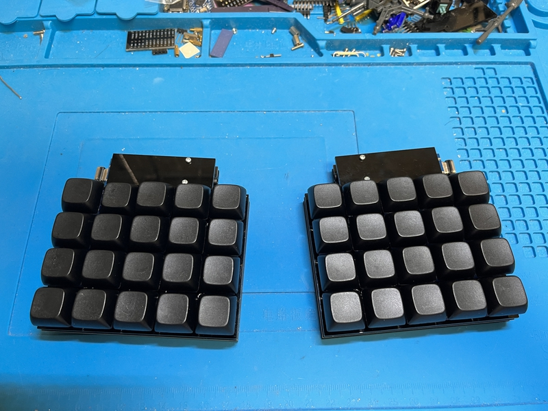

Prepare a TRRS cable or a USB cable.
 
TRRSケーブルやUSBケーブルを用意しましょう。
 
 
Have a fun selfmade keyboard life!
 
楽しい自作キーボード生活を!

